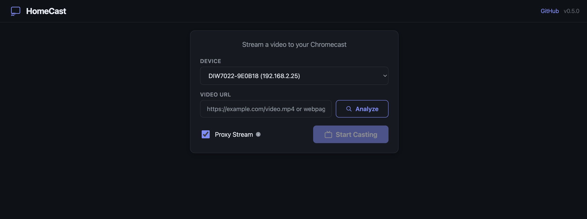
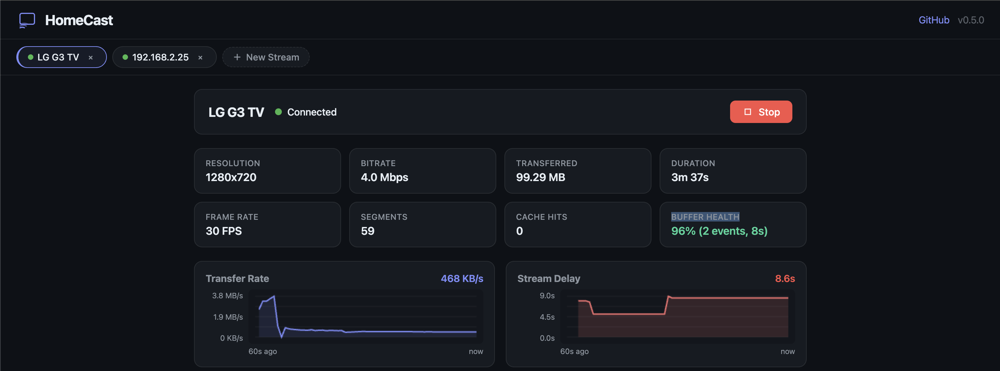

<div align="center">

<h1 style="margin: 0;"> HomeCast</h1>

**🏠 Self-hosted Chromecast streaming for your home network**

[](LICENSE)
[](https://github.com/simno/homecast/actions/workflows/test.yml)
[](https://github.com/simno/homecast/actions/workflows/docker.yml)
[](https://nodejs.org)

Stream videos from the web to your Chromecast devices. Simple, fast, and fully self-hosted.

[Features](#features) • [Installation](#installation) • [Usage](#usage)

</div>

---

## Info

For many TVs or Chromecast devices, streaming directly from websites can be challenging due to compatibility issues,
CORS restrictions, or unsupported formats. Also using a laptop or mobile browser to cast can be unreliable, drain
battery life and interrupt other tasks. HomeCast solves this by acting as a smart intermediary that extracts video
sources from webpages and serves them to your Chromecast in a compatible format.

> [!WARNING]
> This is a personal project only tested on a single streaming source. Other sites probably won't work without further
> development. See [Limitations](#limitations) for details.

> [!IMPORTANT]
> **Security Notice:** HomeCast is designed for self-hosted use on **trusted private networks** only.
> - SSRF protection is enabled by default
> - Rate limiting prevents abuse
> - Not intended for public internet deployment

## Features

- 🔍 **Auto-Discovery** - Finds Chromecast devices automatically
- 🎯 **Smart Extraction** - Attempts to detect video sources from any webpage
- 🌐 **HLS Support** - Handles live streams and adaptive bitrate
- 🔒 **SSRF Protection** - Blocks access to private IPs and localhost
- ⚡ **Rate Limiting** - Prevents abuse with per-IP limits
- ⚡  **Optimized Performance** - Connection pooling, DNS caching, large buffers
- 🐳 **Docker Ready** - One command to run
- 🔒 **Private** - Everything stays on your network
- 💨 **Lightweight** - <50MB Docker image

## Screenshots




---

## Installation

### Docker (GitHub Container Registry)

```bash
# Pull and run the latest image
docker run -d \
  --name homecast \
  --network host \
  --restart unless-stopped \
  -e PORT=3000 \
  ghcr.io/simno/homecast:latest

# Access at http://localhost:3000
```

### Docker Compose (Recommended)

Create a `docker-compose.yml` file:

```yaml
services:
  homecast:
    image: ghcr.io/simno/homecast:latest
    container_name: homecast
    network_mode: host  # Required for mDNS device discovery
    restart: unless-stopped
    environment:
      - NODE_ENV=production
      - PORT=3000
      # Optional: Set your machine's LAN IP if auto-detection fails
      # - HOST_IP=192.168.1.100
```

Then start:

```bash
docker compose up -d
```

### Build from Source

```bash
# Clone repository
git clone https://github.com/simno/homecast.git
cd homecast

# Start with Docker Compose
docker compose up -d

# OR build and run manually
docker build -t homecast:local .
docker run -d --name homecast --network host homecast:local
```

### Node.js

```bash
# Requires Node.js 24 or higher
node --version  # Should be v24.x or higher

# Install
npm install

# Run
node server.js

# Access at http://localhost:3000
```

## Usage

1. **Select Device** - Choose your Chromecast from the dropdown
2. **Enter URL** - Paste any video URL or webpage
3. **Analyze** - Click to extract the video source
4. **Cast** - Hit the cast button and enjoy!

### Supported Sources

- Direct videos: MP4, WebM
- Streaming: HLS (m3u8), DASH
- Simple webpage embeds with direct video links

### Limitations

**HomeCast is designed for simple webpage videos only.** It cannot extract streams from:

- **Twitch** - Requires OAuth and complex API authentication
- **YouTube** - Protected by multiple DRM and anti-scraping measures
- **Netflix, Disney+, Hulu** - DRM-protected content
- **Complex streaming platforms** - Sites with encrypted manifests or authentication
- **MJPEG webcam streams** - Not supported by Chromecast protocol (requires transcoding)

For these services, use their official apps or browser extensions.

### Tips

- Keep "Proxy Stream" enabled for best compatibility
- Use "Manual IP" if your device isn't discovered
- Works best with simple video hosting sites and direct stream URLs

## Configuration

### Environment Variables

| Variable   | Default       | Description                        |
|------------|---------------|------------------------------------|
| `PORT`     | `3000`        | Web interface port                 |
| `HOST_IP`  | Auto-detect   | Server IP for callbacks            |
| `NODE_ENV` | `development` | Set to `production` for deployment |
| `DISABLE_SSRF_PROTECTION` | `false` | **⚠️ DANGER:** Disables SSRF protection (not recommended) |

### Security

Because HomeCast proxies external URLs, it needs to be secured against Server-Side Request Forgery (SSRF) attacks.
It should only be run on trusted private networks.

**SSRF Protection** (enabled by default):
- Blocks access to private IP ranges
- Blocks localhost and loopback addresses
- Blocks cloud metadata endpoints

To disable for trusted LAN environments where local network access is needed:
```bash
docker run -e DISABLE_SSRF_PROTECTION=true ...
```

### Firewall

Ensure these ports are open:

- `3000/tcp` - Web interface (or your custom PORT)
- `5353/udp` - mDNS device discovery

## Troubleshooting

### No Devices Found

**Docker Users:** mDNS discovery requires specific network configuration.

1. **Verify network mode:**
   ```bash
   docker inspect homecast | grep NetworkMode
   # Should show: "NetworkMode": "host"
   ```

2. **Check discovery logs:**
   ```bash
   docker logs homecast | grep Discovery
   ```

3. **Debug endpoint:**
   Visit `http://localhost:3000/api/discovery/status` to see network interfaces and discovery status.

4. **Common issues:**
    - Docker not using `network_mode: host` (bridge mode blocks mDNS)
    - Firewall blocking UDP port 5353
    - Server and Chromecast on different networks/VLANs
    - Container running on a VPS/cloud (mDNS only works on LAN)

5. **Workaround:** Use "Enter IP Manually" and enter your Chromecast's IP address directly.

### Won't Connect

- Verify HOST_IP is set to your server's correct IP
- Check firewall allows inbound connections on PORT
- Ensure proxy stream is enabled

### Video Won't Play

- Enable "Proxy Stream" option
- Check server logs for errors
- Verify the source URL is still valid

## How It Works

```
┌─────────┐      ┌───────────────────┐      ┌─────────────┐
│ Browser │ ───> │  HomeCast         │ ───> │ Chromecast  │
└─────────┘      │   Server          │      └─────────────┘
                 │                   │
                 │ • Extract URL     │
                 │ • Rewrite HLS     │
                 │ • Proxy Stream    │
                 │ • Connection Pool │
                 │ • Smart Cache     │
                 └───────────────────┘
```

HomeCast acts as a bridge between web content and your Chromecast, handling:

- URL extraction from webpages
- HLS playlist rewriting for compatibility
- Stream proxying with adaptive caching
- CORS handling
- Performance optimization (connection pooling, DNS caching, buffer tuning)

## Technical Details

- **Backend**: Node.js, Express
- **Protocols**: Cast v2, mDNS, HLS
- **Caching**: Adaptive (4s for live, 60s for VOD)
- **Performance**: Connection pooling, DNS caching, 256KB buffers
- **Image**: Alpine Linux (~50MB)

## Development

```bash
npm install                 # Install dependencies

npm run dev                 # Run in development mode
```

### Testing & Quality Control

```bash
npm test                    # Run all tests

npm run lint                # Run ESLint

npm run typecheck           # Run TypeScript type checking

npm run check               # Run all checks (lint + typecheck + test)
```

### CI/CD Pipeline

This project uses GitHub Actions for continuous integration and deployment:

- **Test workflow** (`test.yml`): Runs on all branches and PRs
    - Linting with ESLint
    - Type checking with TypeScript
    - Unit tests

- **Docker workflow** (`docker.yml`): Runs on `main` branch
    - Builds multi-platform Docker images (amd64, arm64)
    - Publishes to GitHub Container Registry
    - Creates attestations for supply chain security
    - Tags: `latest`, version tags (e.g., `v1.0.0`)

**Docker images are available at:**

- `ghcr.io/simno/homecast:latest` - Latest stable release
- `ghcr.io/simno/homecast:v*.*.*` - Specific version tags

## License

[MIT License](LICENSE) - Free to use, modify, and distribute.

## Acknowledgments

Built with:

- [castv2-client](https://github.com/thibauts/node-castv2-client) - Chromecast protocol
- [mdns-js](https://github.com/mdns-js/node-mdns-js) - Device discovery
