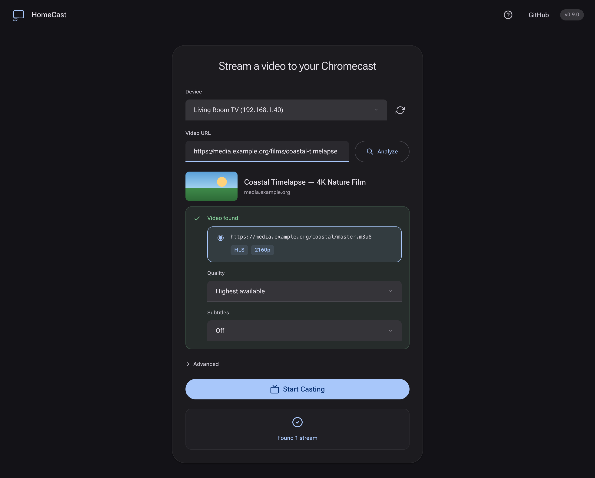
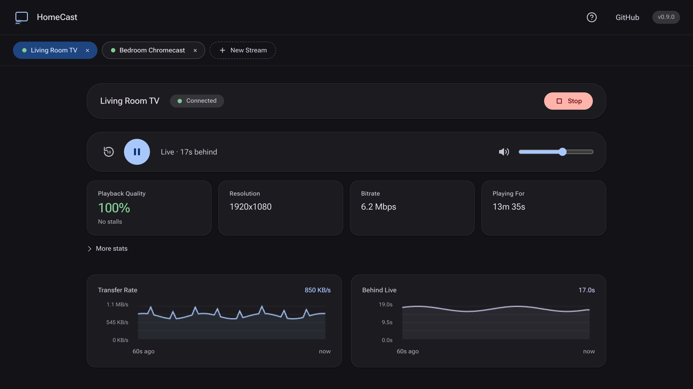

<div align="center">

<h1 style="margin: 0;"> HomeCast</h1>

**🏠 Self-hosted streaming to Chromecast and Apple TV**

[](LICENSE)
[](https://github.com/simno/homecast/actions/workflows/test.yml)
[](https://github.com/simno/homecast/actions/workflows/docker.yml)
[](https://github.com/simno/homecast/pkgs/container/homecast)
[](https://nodejs.org)

Stream videos from the web to your Chromecast and Apple TV devices. Simple, fast, and fully self-hosted.

[Features](#features) • [Installation](#installation) • [Usage](#usage)

</div>

---

## Info

For many TVs or streaming devices, casting directly from websites can be challenging due to compatibility issues,
CORS restrictions, or unsupported formats. Using a laptop or mobile browser to cast can also be unreliable, drain
battery life, and interrupt other tasks. HomeCast solves this by acting as a smart intermediary that extracts video
sources from webpages and serves them to your devices in a compatible format.

> [!WARNING]
> This is a personal project primarily tested on a limited set of streaming sources. Other sites probably won't work
> without further development. See [Limitations](#limitations) for details.

> [!IMPORTANT]
> **Security Notice:** HomeCast is designed for self-hosted use on **trusted private networks** only.
> - SSRF protection is enabled by default
> - Rate limiting prevents abuse
> - Not intended for public internet deployment

## Features

- 🔍 **Auto-Discovery** — Finds Chromecast and Apple TV devices automatically via mDNS
- 🎯 **Smart Extraction** — Finds the stream behind a webpage: player markup, embedded JSON, iframe chains, player scripts, and a headless-browser fallback that watches the page's network traffic
- 📺 **Twitch** — Live channels and VODs resolved to castable HLS
- 🌐 **HLS & DASH** — Live and on-demand, with a quality picker (DASH plays on Chromecast; Apple TV takes HLS and MP4)
-  **AirPlay Casting** — Stream directly to Apple TV over the AirPlay protocol
- 🔐 **AirPlay PIN Pairing** — Pair with secured Apple TVs using the on-screen PIN code
- ⚡ **Wake-on-LAN** — Automatically wakes sleeping devices before casting
- 🔒 **SSRF Protection** — Blocks access to private IPs and localhost
- ⚡ **Rate Limiting** — Prevents abuse with per-IP limits
- ⚡ **Optimized Performance** — Connection pooling, DNS caching, large buffers
- 🐳 **Docker Ready** — One command to run
- 🔒 **Private** — Everything stays on your network

## Screenshots




---

## Installation

### Choosing an image

| Tag      | Download | Includes                                                                                   |
|----------|----------|--------------------------------------------------------------------------------------------|
| `latest` | ~330MB   | Everything, including the headless browser that finds streams on JavaScript-only players   |
| `lite`   | ~90MB    | Everything except the headless browser                                                     |

Direct stream links, HLS/DASH, Twitch and ordinary embedded players work the same in both. Pick `latest` unless size
matters: some sites only reveal their stream once the page's JavaScript runs, and `lite` can't find those (Analyze
tells you when this may be the case). Versioned tags follow the same pattern: `1.2.3` and `1.2.3-lite`.

### Docker (GitHub Container Registry)

```bash
# Pull and run the latest image
docker run -d \
  --name homecast \
  --network host \
  --restart unless-stopped \
  -v homecast-data:/app/data \
  -e PORT=3000 \
  ghcr.io/simno/homecast:latest

# Access at http://localhost:3000
```

The `homecast-data` volume keeps AirPlay pairings when the container is re-created (e.g. on upgrade). Without it,
Apple TVs that need a PIN have to be paired again each time.

### Docker Compose (Recommended)

Create a `docker-compose.yml` file:

```yaml
services:
  homecast:
    image: ghcr.io/simno/homecast:latest
    container_name: homecast
    network_mode: host  # Required for mDNS device discovery
    restart: unless-stopped
    volumes:
      - homecast-data:/app/data  # Keeps AirPlay pairings across upgrades
    environment:
      - NODE_ENV=production
      - PORT=3000
      # Optional: Set your machine's LAN IP if auto-detection fails
      # - HOST_IP=192.168.1.100

volumes:
  homecast-data:
```

> [!NOTE]
> To use a host directory instead of a named volume (e.g. `./data:/app/data`), create it first and make it writable
> by the container user: `mkdir data && sudo chown 1001:1001 data`.

Then start:

```bash
docker compose up -d
```

### Build from Source

```bash
# Clone repository
git clone https://github.com/simno/homecast.git
cd homecast

# Start with Docker Compose
docker compose up -d

# OR build and run manually
docker build -t homecast:local .                                # full
# docker build --build-arg VARIANT=lite -t homecast:local .    # lite
docker run -d --name homecast --network host -v homecast-data:/app/data homecast:local
```

### Node.js

```bash
# Requires Node.js 26 or higher
node --version  # Should be v26.x or higher

# Install
npm install

# Run
node server.js

# Access at http://localhost:3000
```

## Usage

1. **Select Device** — Choose your Chromecast or Apple TV from the dropdown
2. **Enter URL** — Paste any video URL or webpage
3. **Analyze** — Click to extract the video source
4. **Cast** — Hit the cast button and enjoy!

### AirPlay & Apple TV

HomeCast discovers Apple TV devices automatically alongside Chromecast devices. Apple TV devices are marked with an
 icon in the device list.

**If your Apple TV requires a PIN code** (default setting), HomeCast will prompt you to enter the on-screen code the
first time you cast. After pairing, the credentials are stored and reused automatically.

To configure your Apple TV's AirPlay security:
- **Allow Access: Everyone** — No PIN required (always works)
- **Allow Access: Anyone on the Same Network** — May require a PIN
- **Allow Access: Only People Sharing This Home** — PIN pairing required

All modes are supported by HomeCast.

### Supported Sources

- Direct videos: MP4, WebM
- Streaming: HLS (m3u8), DASH
- Simple webpage embeds with direct video links

### How stream detection works

Analyze escalates from cheap to expensive and stops as soon as it finds something castable, showing its progress as it goes (and it can be cancelled at any point):

1. **The URL itself** — a stream link is recognised by its extension or, if it has none, by sniffing the response
2. **The page** — `<video>`/`<source>`, Open Graph and schema.org metadata, and URLs hidden in inline scripts (JSON-escaped, URL-encoded or base64)
3. **Embedded players** — iframes are followed a few levels deep; the frame that holds the player becomes the Referer
4. **Player scripts** — the page's own external scripts are searched
5. **A headless browser** — the page is run, the player is nudged to start, and its network requests are captured (also used when a site blocks plain HTTP requests). Not available in the `lite` image

Every candidate is then checked: dead links are dropped, HLS masters report their qualities, MP4s their resolution and size, and the most likely main video is listed first (ads, previews and segments are ranked down).

### Limitations

**HomeCast works best with ordinary webpage players.** It cannot extract streams from:

- **YouTube** — Protected by multiple DRM and anti-scraping measures
- **Netflix, Disney+, Hulu** — DRM-protected content
- **Complex streaming platforms** — Sites with encrypted manifests or authentication
- **MJPEG webcam streams** — Not supported by Chromecast protocol (requires transcoding)
- **DRM-protected DASH** — Streams with `ContentProtection` are listed but can't be cast
- **DASH on Apple TV** — AirPlay only plays HLS and MP4; cast DASH streams to a Chromecast

For these services, use their official apps or browser extensions.

### Tips

- Keep "Proxy Stream" enabled for best compatibility
- Use "Manual IP" if your device isn't discovered
- Works best with simple video hosting sites and direct stream URLs

## Configuration

### Environment Variables

| Variable                     | Default        | Description                                                                                  |
|------------------------------|----------------|----------------------------------------------------------------------------------------------|
| `PORT`                       | `3000`         | Web interface port                                                                           |
| `STALE_DEVICE_TIMEOUT_HOURS` | `3`            | Hours before inactive devices are removed (increase if devices send infrequent mDNS updates) |
| `HOST_IP`                    | Auto-detect    | Server IP for callbacks                                                                      |
| `NODE_ENV`                   | `development`  | Set to `production` for deployment                                                           |
| `CSRF_SECRET`                | Auto-generated | Persistent CSRF secret (set to keep tokens valid across restarts)                            |
| `DISABLE_CSRF`               | `false`        | Disable CSRF protection (not recommended)                                                    |
| `DISABLE_SSRF_PROTECTION`    | `false`        | **⚠️ DANGER:** Disables SSRF protection (not recommended)                                    |
| `PLAYWRIGHT_BROWSERS_PATH`   | Auto-detected  | Path to Playwright browser binaries                                                          |
| `AIRPLAY_PAIRING_STORE`      | `./data/airplay-pairings.json` | Path to AirPlay pairing data file                                           |

### Security

Because HomeCast proxies external URLs, it needs to be secured against Server-Side Request Forgery (SSRF) attacks.
It should only be run on trusted private networks.

**SSRF Protection** (enabled by default):

- Blocks access to private IP ranges
- Blocks localhost and loopback addresses
- Blocks cloud metadata endpoints

To disable for trusted LAN environments where local network access is needed:

```bash
docker run -e DISABLE_SSRF_PROTECTION=true ...
```

### Firewall

Ensure these ports are open:

- `3000/tcp` — Web interface (or your custom PORT)
- `5353/udp` — mDNS device discovery
- `7000/tcp` — AirPlay protocol (outbound to Apple TV devices)

## Troubleshooting

### No Devices Found

**Docker Users:** mDNS discovery requires specific network configuration.

1. **Verify network mode:**
   ```bash
   docker inspect homecast | grep NetworkMode
   # Should show: "NetworkMode": "host"
   ```

2. **Check discovery logs:**
   ```bash
   docker logs homecast | grep -E "AirPlay|Discovery"
   ```

3. **Debug endpoint:**
   Visit `http://localhost:3000/api/discovery/status` to see network interfaces and discovery status.

4. **Common issues:**
    - Docker not using `network_mode: host` (bridge mode blocks mDNS)
    - Firewall blocking UDP port 5353
    - Server and device on different networks/VLANs
    - Container running on a VPS/cloud (mDNS only works on LAN)

5. **Workaround:** Use "Enter IP Manually" and enter your device's IP address directly.

### Won't Connect

- Verify `HOST_IP` is set to your server's correct IP
- Check firewall allows inbound connections on `PORT`
- Ensure proxy stream is enabled
- For AirPlay: verify the Apple TV is on and connected to the same network
- For AirPlay: check that outbound TCP to port 7000 is not blocked

### AirPlay PIN Pairing Issues

- **Wrong PIN:** Check the Apple TV screen — a new code appears each time. Enter exactly the 4-8 digit number shown.
- **Pairing fails:** Ensure the Apple TV and server are on the same local network. Try restarting the Apple TV.
- **Reset pairing:** Unpair the device via the API, or delete `airplay-pairings.json` from the data directory
  (`docker exec homecast rm /app/data/airplay-pairings.json` in Docker) and restart.
- **"Everyone" mode not working:** Some Apple TV models require at least one pairing before accepting unauthenticated
  connections. Try pairing once even if set to "Everyone."

### Video Won't Play

- Enable "Proxy Stream" option
- Check server logs for errors
- Verify the source URL is still valid

## How It Works

```
┌─────────┐      ┌───────────────────────┐      ┌──────────────────┐
│ Browser │ ───> │  HomeCast             │ ───> │ Chromecast       │
└─────────┘      │   Server              │      │ Apple TV         │
                 │                       │      └──────────────────┘
                 │ • Extract URL         │
                 │ • Rewrite HLS         │
                 │ • Proxy Stream        │
                 │ • AirPlay Pairing     │
                 │ • Wake-on-LAN         │
                 │ • Smart Cache         │
                 └───────────────────────┘
```

HomeCast acts as a bridge between web content and your devices, handling:

- URL extraction from webpages
- HLS playlist rewriting for compatibility
- Stream proxying with adaptive caching
- AirPlay protocol for Apple TV (discovery, PIN pairing, casting)
- Chromecast protocol via castv2
- Wake-on-LAN for sleeping devices
- CORS handling
- Performance optimization (connection pooling, DNS caching, buffer tuning)

## Technical Details

- **Backend**: Node.js 26+, Express 5
- **Protocols**: Cast v2, AirPlay 1 (port 7000), mDNS (discovery), HLS
- **AirPlay**: SRP-6a PIN pairing (2048-bit), Curve25519 + Ed25519 pair-verify
- **Caching**: Adaptive (4s for live, 60s for VOD)
- **Performance**: Connection pooling, DNS caching, 256KB buffers
- **Image**: Debian slim (`node:26-slim`); the full image adds Playwright's headless Chromium

## Development

```bash
npm install                 # Install dependencies

npm run dev                 # Run in development mode
```

When running in development mode, a mock Chromecast device is available for selection, allowing for testing without a
physical device.

### Testing & Quality Control

```bash
npm test                    # Run all tests (node:test)

npm run test:coverage       # Run all tests with a coverage report

npm run lint                # Run ESLint

npm run typecheck           # Run TypeScript type checking

npm run check               # Run all checks (lint + typecheck + test)
```

### CI/CD Pipeline

This project uses GitHub Actions for continuous integration and deployment:

- **Test workflow** (`test.yml`): Runs on all branches and PRs
    - Linting with ESLint
    - Type checking with TypeScript
    - Unit tests, plus HTTP tests against the fully wired server

- **Docker workflow** (`docker.yml`): Runs on version tags (`v*.*.*`)
    - Builds multi-platform Docker images (amd64, arm64), in `full` and `lite` variants
    - Publishes to GitHub Container Registry
    - Creates attestations for supply chain security
    - Tags: `latest`, plus the version at each precision (e.g. `1.2.3`, `1.2`, `1`)

**Docker images are available at:**

- `ghcr.io/simno/homecast:latest` — Latest stable release
- `ghcr.io/simno/homecast:lite` — Latest stable release, without the headless browser
- `ghcr.io/simno/homecast:1.2.3` / `1.2.3-lite` — A specific version (`1.2`, `1` and their `-lite` forms track the
  latest patch/minor)

### Release Process

The project includes an automated release script that ensures version consistency:

```bash
npm run release:patch   # 0.1.0 → 0.1.1 (bug fixes)
npm run release:minor   # 0.1.1 → 0.2.0 (new features)
npm run release:major   # 0.2.0 → 1.0.0 (breaking changes)
```

The script automatically:

1. Runs all checks (lint, typecheck, tests)
2. Bumps version in `package.json` and `package-lock.json`
3. Creates a git commit
4. Creates a git tag (e.g., `v0.1.1`)
5. Asks for confirmation to push
6. Pushes the commit and tag to trigger the Docker build

This automatically triggers the Docker workflow to build and publish the new version to GHCR.

## License

[MIT License](LICENSE) — Free to use, modify, and distribute.

## Acknowledgments

Built with:

- [castv2-client](https://github.com/thibauts/node-castv2-client) — Chromecast protocol
- [mdns-js](https://github.com/mdns-js/node-mdns-js) — Device discovery
