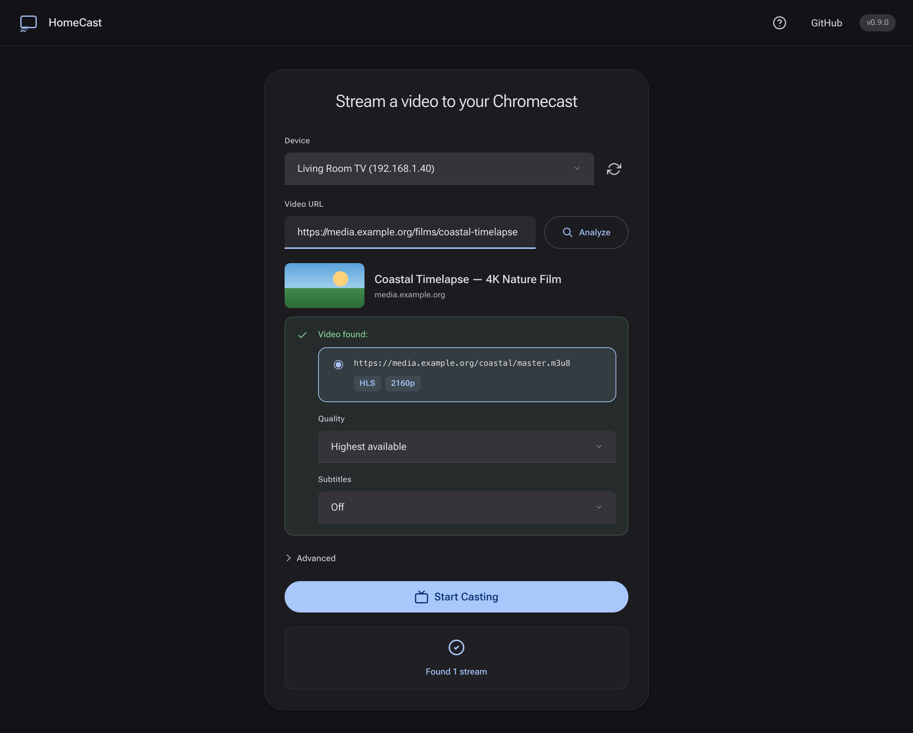
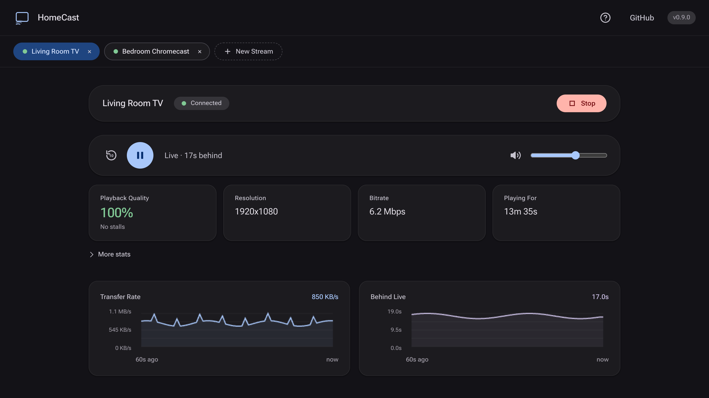

<div align="center">

<h1 style="margin: 0;"> HomeCast</h1>

**🏠 Self-hosted streaming to Chromecast and Apple TV**

[](LICENSE)
[](https://github.com/simno/homecast/actions/workflows/test.yml)
[](https://github.com/simno/homecast/actions/workflows/docker.yml)
[](https://github.com/simno/homecast/pkgs/container/homecast)
[](https://nodejs.org)

Stream videos from the web to your Chromecast and Apple TV devices. Simple, fast, and fully self-hosted.

[Features](#features) • [Installation](#installation) • [Usage](#usage)

</div>

---

## Info

For many TVs or streaming devices, casting directly from websites can be challenging due to compatibility issues,
CORS restrictions, or unsupported formats. Using a laptop or mobile browser to cast can also be unreliable, drain
battery life, and interrupt other tasks. HomeCast solves this by acting as a smart intermediary that extracts video
sources from webpages and serves them to your devices in a compatible format.

> [!WARNING]
> This is a personal project primarily tested on a limited set of streaming sources. Other sites probably won't work
> without further development. See [Limitations](#limitations) for details.

> [!IMPORTANT]
> **Security Notice:** HomeCast is designed for self-hosted use on **trusted private networks** only.
> - SSRF protection is enabled by default
> - Rate limiting prevents abuse
> - Not intended for public internet deployment

## Features

- 🔍 **Auto-Discovery** — Finds Chromecast, Apple TV and LG TV devices automatically (mDNS and SSDP)
- 🎯 **Smart Extraction** — Finds the stream behind a webpage: player markup, embedded JSON, iframe chains, player scripts, and a headless-browser fallback that watches the page's network traffic
- 📺 **Twitch** — Live channels and VODs resolved to castable HLS
- 💬 **Subtitles** — Picks up subtitles from the page and from HLS/DASH manifests, or casts a WebVTT/SRT file by URL; switch or turn them off while playing
- 🌐 **HLS & DASH** — Live and on-demand, with a quality picker (DASH plays on Chromecast; Apple TV takes HLS and MP4)
- 🎞️ **4K on Chromecast** — 4K H.264 streams (X/Periscope broadcasts) converted to HEVC on the fly with an Intel, AMD or NVIDIA GPU, so 4K Chromecasts and Cast TVs can play them. See [4K on Chromecast](#4k-on-chromecast-hevc-conversion)
- 🔴 **Live Streams** — Start near the live edge, with a timeline to go back and a Go live button to catch up
- 🎮 **Remote Control** — Pause, skip, seek on the timeline and set the volume from the dashboard (volume on Chromecast; Apple TV uses its remote)
- 🕘 **Recent Casts** — Recently cast pages are one click away (remove any you don't want), and the last device is preselected
- 🩺 **Stream Recovery** — Stalled streams restart automatically, with progress shown on the dashboard; a stream the TV can't play is stopped with the TV's reason instead of retried
- 📡 **AirPlay Casting** — Stream to Apple TVs over AirPlay (not TVs with AirPlay 2 built in; see [AirPlay & Apple TV](#airplay--apple-tv))
- 🔐 **AirPlay PIN Pairing** — Pair with secured Apple TVs using the on-screen PIN code
- 📺 **LG TVs** — Play in the TV's own browser, 4K H.264 included, with no conversion or GPU needed. See [LG TVs (webOS)](#lg-tvs-webos)
- ⚡ **Wake-on-LAN** — Automatically wakes sleeping devices before casting
- 🔒 **SSRF Protection** — Blocks access to private IPs and localhost
- ⚡ **Rate Limiting** — Prevents abuse with per-IP limits
- ⚡ **Optimized Performance** — Connection pooling, DNS caching, large buffers
- 🐳 **Docker Ready** — One command to run
- 🔒 **Private** — Everything stays on your network

## Screenshots




---

## Installation

### Choosing an image

| Tag      | Download (amd64 / arm64) | Includes                                                                    |
|----------|--------------------------|-----------------------------------------------------------------------------|
| `latest` | ~420MB / ~330MB          | Everything, including the headless browser that finds streams on JavaScript-only players |
| `lite`   | ~180MB / ~90MB           | Everything except the headless browser                                      |

Direct stream links, HLS/DASH, Twitch and ordinary embedded players work the same in both. Pick `latest` unless size
matters: some sites only reveal their stream once the page's JavaScript runs, and `lite` can't find those (Analyze
tells you when this may be the case). Versioned tags follow the same pattern: `1.2.3` and `1.2.3-lite`.

The amd64 images include FFmpeg for [4K conversion](#4k-on-chromecast-hevc-conversion) (about 90MB of each
download): [Jellyfin's build](https://github.com/jellyfin/jellyfin-ffmpeg), which has the encoders for Intel, AMD and
NVIDIA GPUs and bundles the Intel and AMD drivers. arm64 images leave it out. To build an amd64 image without it, see
[Build from Source](#build-from-source).

### Docker (GitHub Container Registry)

```bash
# Pull and run the latest image
docker run -d \
  --name homecast \
  --network host \
  --restart unless-stopped \
  -v homecast-data:/app/data \
  -e PORT=3000 \
  ghcr.io/simno/homecast:latest

# Access at http://localhost:3000
```

The `homecast-data` volume keeps AirPlay pairings and LG TV keys when the container is re-created (e.g. on upgrade).
Without it, Apple TVs that need a PIN have to be paired again each time, and LG TVs ask to allow HomeCast again.

### Docker Compose (Recommended)

Create a `docker-compose.yml` file:

```yaml
services:
  homecast:
    image: ghcr.io/simno/homecast:latest
    container_name: homecast
    network_mode: host  # Required for mDNS device discovery
    restart: unless-stopped
    volumes:
      - homecast-data:/app/data  # Keeps AirPlay pairings across upgrades
    environment:
      - NODE_ENV=production
      - PORT=3000
      # Optional: Set your machine's LAN IP if auto-detection fails
      # - HOST_IP=192.168.1.100
    # Optional: a GPU for 4K conversion (see "4K on Chromecast").
    # Intel or AMD — group_add: the group that owns the render node on the
    # host, from: stat -c %g /dev/dri/renderD128
    # devices:
    #   - /dev/dri:/dev/dri
    # group_add:
    #   - "992"
    # NVIDIA — with the NVIDIA Container Toolkit installed on the host:
    # deploy:
    #   resources:
    #     reservations:
    #       devices:
    #         - driver: nvidia
    #           count: 1
    #           capabilities: [gpu, video, utility]

volumes:
  homecast-data:
```

> [!NOTE]
> To use a host directory instead of a named volume (e.g. `./data:/app/data`), create it first and make it writable
> by the container user: `mkdir data && sudo chown 1001:1001 data`.

Then start:

```bash
docker compose up -d
```

### Build from Source

```bash
# Clone repository
git clone https://github.com/simno/homecast.git
cd homecast

# Start with Docker Compose
docker compose up -d

# OR build and run manually
docker build -t homecast:local .                                # full
# docker build --build-arg VARIANT=lite -t homecast:local .    # lite
docker run -d --name homecast --network host -v homecast-data:/app/data homecast:local
```

Add `--build-arg TRANSCODE=none` to leave out FFmpeg (no 4K conversion, ~90MB smaller).

### Node.js

```bash
# Requires Node.js 26 or higher
node --version  # Should be v26.x or higher

# Install
npm install

# Run
node server.js

# Access at http://localhost:3000
```

## Usage

1. **Select Device** — Choose your Chromecast or Apple TV from the dropdown
2. **Enter URL** — Paste any video URL or webpage
3. **Analyze** — Click to extract the video source
4. **Cast** — Hit the cast button and enjoy!

### AirPlay & Apple TV

HomeCast discovers Apple TV devices automatically alongside Chromecast devices. Apple TV devices are marked
**· AirPlay** in the device list.

**If your Apple TV requires a PIN code** (default setting), HomeCast will prompt you to enter the on-screen code the
first time you cast. After pairing, the credentials are stored and reused automatically.

To configure your Apple TV's AirPlay security:
- **Allow Access: Everyone** — No PIN required (always works)
- **Allow Access: Anyone on the Same Network** — May require a PIN
- **Allow Access: Only People Sharing This Home** — PIN pairing required

All modes are supported by HomeCast.

**TVs with AirPlay 2 built in** (LG, Samsung and others) aren't offered as AirPlay targets: they play video only over
AirPlay 2's encrypted sessions, not the AirPlay 1 video that HomeCast sends. Most have Chromecast built in as well and
show up as a Cast device, and LG TVs can also be cast to through their browser (see [LG TVs (webOS)](#lg-tvs-webos)).
The server log says why each is skipped (`no AirPlay 1 video`).

### LG TVs (webOS)

LG TVs show up as **· LG webOS** in the device list. An LG TV with Chromecast built in on the same address
appears twice, **· Cast** and **· LG webOS**: pick either.

Casting to **· LG webOS** opens HomeCast's player in the TV's own web browser, full screen. The TV decodes the stream
itself, so 4K H.264 plays as it is: no [conversion](#4k-on-chromecast-hevc-conversion), no GPU, and no quality lost to
re-encoding. Pause, seek, go live and the volume work from the dashboard; the remote's play/pause and left/right keys
work on the TV too. Stop (or a video playing to its end) returns the TV to the input or app it was showing.

- **The first cast** shows an "allow this device?" prompt on the TV. Accept it with the remote; HomeCast keeps the TV's
  key (in `data/webos-keys.json`) and later casts start without asking.
- **The TV must be able to reach HomeCast** on its port, since the TV fetches the player page and the stream from it.
  LG TVs always stream through HomeCast's proxy, whatever the "Proxy stream" setting.
- **Choppy X/Periscope broadcasts**: these streams declare a wrong frame rate (1000 fps) in their video headers, which
  LG's player takes at its word. HomeCast rewrites that header as the segments pass through (no re-encoding), which
  needs FFmpeg: included in the amd64 image, or on the `PATH` when running HomeCast directly.
- **Subtitles** are chosen when casting (a separate file, or a language from the stream); they can't be switched from
  the dashboard during playback.
- DASH streams can't be cast this way; cast them to a Chromecast.

### Supported Sources

- Direct videos: MP4, WebM
- Streaming: HLS (m3u8), DASH
- Webpages whose player uses one of the above, including players inside iframes and players that only load in a browser
  (see [How stream detection works](#how-stream-detection-works))

Sites with handling of their own in the code:

- **Twitch** — live channels and VODs, resolved through Twitch's API
- **X / Periscope broadcasts** — live and replays: replays are told apart from live streams, and the CDN's rejection of
  a Referer is remembered per host. Their 4K version is H.264, which Chromecasts can only play
  [converted](#4k-on-chromecast-hevc-conversion)
- **SpaceX launch pages** (`spacex.com/launches/...`) — the launch webcast is looked up in SpaceX's mission data; X
  broadcasts play, YouTube webcasts can't be cast (see [Limitations](#limitations))

This is what the code handles specifically, not a list of tested sites. If a site works (or doesn't), an issue saying
so is welcome.

### Subtitles

After Analyze, a **Subtitles** picker lists what was found with the video:

- **On the page** — `<track>` subtitles and captions next to the `<video>`
- **In the stream** — subtitle renditions in an HLS master playlist or a DASH manifest
- **From a URL** — any WebVTT or SRT file you point it at, e.g. for a plain MP4 on a file server

| Device     | What works                                                                                                      |
|------------|-----------------------------------------------------------------------------------------------------------------|
| Chromecast | All three. Switch tracks or turn them off from the dashboard while playing                                      |
| Apple TV   | Subtitles inside HLS streams, turned on with the TV remote. AirPlay can't show a separate subtitle file |

Subtitle files are always fetched through HomeCast (even with Proxy stream off), because receivers only accept them
with CORS headers. SRT is converted to WebVTT on the way, and the last language you picked becomes the default for
the next video.

### 4K on Chromecast (HEVC conversion)

Chromecasts and Cast TVs decode 4K only as HEVC, VP9 or AV1, but some sources — X/Periscope broadcasts among them —
offer 4K only as H.264. A Chromecast accepts such a stream, plays a couple of seconds and stops. With a GPU that
encodes HEVC, HomeCast converts these streams as it proxies them, segment by segment, so 4K Chromecasts can play them.

**What you need**

- A GPU that encodes HEVC in hardware, passed through to the container (see the compose example above), on an amd64
  image (it includes FFmpeg):

  | GPU | Encoder | Passing it through |
  |-----|---------|--------------------|
  | **Intel** — Arc, or an iGPU with Quick Sync (6th gen / Skylake or newer) | VAAPI | `devices: /dev/dri:/dev/dri`, and `group_add` with the group that owns the render node (`stat -c %g /dev/dri/renderD128`) |
  | **AMD** — Radeon RX 400 series (Polaris) or newer, and Ryzen APUs with Radeon graphics | VAAPI | Same as Intel |
  | **NVIDIA** — GeForce GTX 950 (second-generation Maxwell) or newer, with a recent driver | NVENC | The [NVIDIA Container Toolkit](https://docs.nvidia.com/datacenter/cloud-native/container-toolkit/latest/install-guide.html) on the host, and the GPU reserved with `capabilities: [gpu, video, utility]` |

- With more than one Intel or AMD GPU (e.g. an Arc next to an iGPU), `TRANSCODE_DEVICE` naming the one to use
  (`renderD129`)

Running HomeCast directly on a Mac (not in Docker) uses Apple's VideoToolbox instead, with the Mac's own FFmpeg.

At startup the log says whether it worked, e.g. `[Transcode] HEVC conversion available via Intel GPU (VAAPI),
renderD129`, or why not (no GPU passed through, no permission to use it, no encoder).

> [!NOTE]
> Conversion was developed and tested on an Intel Arc GPU and on a Mac. AMD and NVIDIA use the same pipeline with
> their own encoders, but haven't been tested on real hardware yet — reports welcome.

**Using it**

When conversion is available, a Chromecast's quality picker offers the 4K version as *converted*, and **Highest
available** picks it. There's no way to ask a Cast device whether it can decode 4K HEVC, so the cast itself is the
test: a device that rejects the converted stream before it plays is recast automatically at the best quality it plays
directly, and this browser stops choosing conversion for it. Apple TVs play 4K H.264 themselves and are never
converted.

The dashboard shows a **Converting to HEVC** panel for converted streams: how many times real time the conversion
runs (it has to stay above 1), segments ready ahead of the TV, the converted and source bitrates, and GPU load and
clock. What the load measures depends on what the driver makes readable: the whole GPU on Intel, the encoder itself on
NVIDIA (from `nvidia-smi`), and the graphics engine on AMD, which leaves out the video engine that does the encoding,
so it reads low.

**Quality.** Re-encoding an already-compressed stream needs more bits than the original to keep its quality, so each
segment is encoded at 4× its source bitrate, up to `TRANSCODE_BITRATE` (25 Mbps). Measured on a 5.5 Mbps 4K
broadcast (VMAF against the source), that scores about 94, against 85 for the 1080p version the TV would otherwise
upscale. On a home network the extra bandwidth doesn't matter.

**Limits.** Only unencrypted MPEG-TS HLS segments can be converted (that's what these broadcasts use); anything else
plays as it is. Starting takes a few seconds, since the TV waits for about 10 seconds of converted video before it
plays.

### How stream detection works

Analyze escalates from cheap to expensive and stops as soon as it finds something castable, showing its progress as it goes (and it can be cancelled at any point):

1. **The URL itself** — a stream link is recognised by its extension or, if it has none, by sniffing the response
2. **The page** — `<video>`/`<source>`, Open Graph and schema.org metadata, and URLs hidden in inline scripts (JSON-escaped, URL-encoded or base64)
3. **Embedded players** — iframes are followed a few levels deep; the frame that holds the player becomes the Referer
4. **Player scripts** — the page's own external scripts are searched
5. **A headless browser** — the page is run, the player is nudged to start, and its network requests are captured (also used when a site blocks plain HTTP requests). Not available in the `lite` image

Every candidate is then checked: dead links are dropped, HLS masters report their qualities, MP4s their resolution and size, and the most likely main video is listed first (ads, previews and segments are ranked down).

### Limitations

**HomeCast works best with ordinary webpage players.** It cannot extract streams from:

- **YouTube** — Protected by multiple DRM and anti-scraping measures
- **Netflix, Disney+, Hulu** — DRM-protected content
- **Complex streaming platforms** — Sites with encrypted manifests or authentication
- **MJPEG webcam streams** — Chromecasts can't play them, and HomeCast's [conversion](#4k-on-chromecast-hevc-conversion)
  only covers 4K HLS streams, not continuous MJPEG
- **DRM-protected DASH** — Streams with `ContentProtection` are listed but can't be cast
- **DASH on Apple TV** — AirPlay only plays HLS and MP4; cast DASH streams to a Chromecast
- **AirPlay 2-only TVs** — LG, Samsung and other TVs with AirPlay 2 built in; cast to them over Chromecast, or to an LG
  TV through [its browser](#lg-tvs-webos)
- **4K H.264 on Chromecast without a supported GPU** — plays at 1080p (see [4K on Chromecast](#4k-on-chromecast-hevc-conversion));
  an LG TV plays it in 4K [through its browser](#lg-tvs-webos)

For these services, use their official apps or browser extensions.

### Tips

- Keep "Proxy stream" (under Advanced) enabled for best compatibility
- Press the rescan button next to the device list, or use "Manual IP", if your device isn't discovered
- Works best with simple video hosting sites and direct stream URLs

## Configuration

### Environment Variables

| Variable                     | Default        | Description                                                                                  |
|------------------------------|----------------|----------------------------------------------------------------------------------------------|
| `PORT`                       | `3000`         | Web interface port                                                                           |
| `STALE_DEVICE_TIMEOUT_HOURS` | `3`            | Hours before inactive devices are removed (increase if devices send infrequent mDNS updates) |
| `HOST_IP`                    | Auto-detect    | Server IP for callbacks                                                                      |
| `NODE_ENV`                   | `development`  | Set to `production` for deployment                                                           |
| `CSRF_SECRET`                | Auto-generated | Persistent CSRF secret (set to keep tokens valid across restarts)                            |
| `DISABLE_CSRF`               | `false`        | Disable CSRF protection (not recommended)                                                    |
| `DISABLE_SSRF_PROTECTION`    | `false`        | **⚠️ DANGER:** Disables SSRF protection (not recommended)                                    |
| `PLAYWRIGHT_BROWSERS_PATH`   | Auto-detected  | Path to Playwright browser binaries                                                          |
| `AIRPLAY_PAIRING_STORE`      | `./data/airplay-pairings.json` | Path to AirPlay pairing data file                                           |
| `WEBOS_KEY_STORE`            | `./data/webos-keys.json` | Path to the keys LG TVs give HomeCast when it's allowed on them                  |
| `TRANSCODE_DEVICE`           | Auto (tries each `/dev/dri/renderD*`) | GPU for 4K conversion, e.g. `renderD129` or `/dev/dri/renderD129` |
| `TRANSCODE_ENCODER`          | `auto`         | `auto`, `vaapi` (Intel, AMD), `nvenc` (NVIDIA), `videotoolbox` (Mac), `x265` (software, too slow for 4K; for testing) or `off` |
| `TRANSCODE_BITRATE`          | `25M`          | Most a converted segment gets (each gets 4× its source bitrate up to this)   |
| `TRANSCODE_CONCURRENCY`      | `1`            | Segments encoded at once. Most GPUs have one video engine, where two encodes only take turns; try `2` on one with two |

#### Advanced tuning

Defaults suit most networks; change these only to work around a specific problem.

| Variable                     | Default | Description                                                                          |
|------------------------------|---------|--------------------------------------------------------------------------------------|
| `STALL_TIMEOUT_SECONDS`      | `15`    | Seconds a Chromecast can buffer without fetching any media before it's restarted     |
| `MAX_RECOVERY_ATTEMPTS`      | `3`     | Stall restarts to try before giving up                                               |
| `HEARTBEAT_INTERVAL_SECONDS` | `5`     | How often each device connection is checked                                          |
| `MAX_MISSED_HEARTBEATS`      | `3`     | Missed checks before a connection is marked unhealthy                                |
| `RECONNECT_DELAY_SECONDS`    | `10`    | Wait before reconnecting to a device that dropped                                    |
| `MAX_RECONNECT_ATTEMPTS`     | `3`     | Reconnection attempts before giving up                                               |
| `CACHE_TTL_VOD_SECONDS`      | `60`    | How long an on-demand HLS playlist is cached                                         |
| `CACHE_TTL_LIVE_SECONDS`     | `4`     | How long a live HLS playlist is cached (keep below the segment duration)             |

### Security

Because HomeCast proxies external URLs, it needs to be secured against Server-Side Request Forgery (SSRF) attacks.
It should only be run on trusted private networks.

**SSRF Protection** (enabled by default):

- Blocks access to private IP ranges
- Blocks localhost and loopback addresses
- Blocks cloud metadata endpoints

To disable for trusted LAN environments where local network access is needed:

```bash
docker run -e DISABLE_SSRF_PROTECTION=true ...
```

### Firewall

Ensure these ports are open:

- `3000/tcp` — Web interface (or your custom PORT)
- `5353/udp` — mDNS device discovery
- `7000/tcp` — AirPlay protocol (outbound to Apple TV devices)

## Troubleshooting

### No Devices Found

**Docker Users:** mDNS discovery requires specific network configuration.

1. **Verify network mode:**
   ```bash
   docker inspect homecast | grep NetworkMode
   # Should show: "NetworkMode": "host"
   ```

2. **Check discovery logs:**
   ```bash
   docker logs homecast | grep -E "AirPlay|Discovery"
   ```

3. **Debug endpoint:**
   Visit `http://localhost:3000/api/discovery/status` to see network interfaces and discovery status.

4. **Common issues:**
    - Docker not using `network_mode: host` (bridge mode blocks mDNS)
    - Firewall blocking UDP port 5353
    - Server and device on different networks/VLANs
    - Container running on a VPS/cloud (mDNS only works on LAN)

5. **Workaround:** Use "Enter IP Manually" and enter your device's IP address directly.

### Won't Connect

- Verify `HOST_IP` is set to your server's correct IP
- Check firewall allows inbound connections on `PORT`
- Ensure proxy stream is enabled
- For AirPlay: verify the Apple TV is on and connected to the same network
- For AirPlay: check that outbound TCP to port 7000 is not blocked

### AirPlay PIN Pairing Issues

- **Wrong PIN:** Check the Apple TV screen — a new code appears each time. Enter exactly the 4-8 digit number shown.
- **Pairing fails:** Ensure the Apple TV and server are on the same local network. Try restarting the Apple TV.
- **Reset pairing:** Unpair the device via the API, or delete `airplay-pairings.json` from the data directory
  (`docker exec homecast rm /app/data/airplay-pairings.json` in Docker) and restart.
- **"Everyone" mode not working:** Some Apple TV models require at least one pairing before accepting unauthenticated
  connections. Try pairing once even if set to "Everyone."

### Video Won't Play

- If the TV gives up on a stream, the dashboard says why (e.g. *The TV could not decode this stream*); try a lower
  quality
- Enable "Proxy stream" (under Advanced)
- Check server logs for errors: `[Cast] Receiver reported …` is the TV's own error
- Verify the source URL is still valid

### 4K Conversion Not Offered

The quality picker only offers converted 4K when the server found a working encoder. Check the startup log:

```bash
docker logs homecast | grep Transcode
```

- `does not exist — is /dev/dri passed through` — add `devices: /dev/dri:/dev/dri`
- `No permission to use /dev/dri/renderD…` — add the render node's group with `group_add` (`stat -c %g /dev/dri/renderD128`)
- `ffmpeg not found` — you're on an arm64 image or one built with `TRANSCODE=none`
- `vaapi (…) unusable` — the GPU doesn't encode HEVC through VAAPI, or the host driver is too old for it
- `nvenc unusable` — the container can't reach the NVIDIA driver: check the NVIDIA Container Toolkit is installed
  and the GPU is reserved with the `video` capability
- `No hardware HEVC encoder`, with an NVIDIA GPU — the GPU isn't reserved for the container at all (no
  `/dev/nvidiactl` inside it)
- With several Intel/AMD GPUs, set `TRANSCODE_DEVICE` to the right one (`ls -l /dev/dri/by-path` shows which render
  node belongs to which PCI slot)

If conversion runs but the dashboard's **Speed** stays near or below 1×, the GPU can't keep up: check nothing else
is using it (another transcoder, say), and that `TRANSCODE_CONCURRENCY` is `1`.

## How It Works

```
┌─────────┐      ┌───────────────────────┐      ┌──────────────────┐
│ Browser │ ───> │  HomeCast             │ ───> │ Chromecast       │
└─────────┘      │   Server              │      │ Apple TV         │
                 │                       │      └──────────────────┘
                 │ • Extract URL         │
                 │ • Rewrite HLS         │
                 │ • Proxy Stream        │
                 │ • Convert 4K to HEVC  │
                 │ • AirPlay Pairing     │
                 │ • Wake-on-LAN         │
                 │ • Smart Cache         │
                 └───────────────────────┘
```

HomeCast acts as a bridge between web content and your devices, handling:

- URL extraction from webpages
- HLS playlist rewriting for compatibility
- Stream proxying with adaptive caching
- 4K H.264 to HEVC conversion for Chromecasts, on an Intel, AMD or NVIDIA GPU
- AirPlay protocol for Apple TV (discovery, PIN pairing, casting)
- Chromecast protocol via castv2
- Wake-on-LAN for sleeping devices
- CORS handling
- Performance optimization (connection pooling, DNS caching, buffer tuning)

## Technical Details

- **Backend**: Node.js 26+, Express 5
- **Protocols**: Cast v2, AirPlay 1 (port 7000), mDNS (discovery, via multicast-dns), HLS, DASH
- **AirPlay**: SRP-6a PIN pairing (2048-bit), Curve25519 + Ed25519 pair-verify
- **4K conversion**: FFmpeg (Jellyfin's build) with VAAPI for Intel and AMD or NVENC for NVIDIA, decoding and
  encoding on the GPU, one process per HLS segment; fragmented MP4
  output that keeps the source timestamps, so independently converted segments join seamlessly
- **Caching**: Adaptive (4s for live, 60s for VOD)
- **Performance**: Connection pooling, DNS caching, 256KB buffers
- **Image**: Debian slim (`node:26-slim`); the full image adds Playwright's headless Chromium, and amd64 images add
  Jellyfin's FFmpeg

## Development

```bash
npm install                 # Install dependencies

npm run dev                 # Run in development mode
```

When running in development mode, a mock Chromecast device is available for selection, allowing for testing without a
physical device.

### Testing & Quality Control

```bash
npm test                    # Run all tests (node:test)

npm run test:coverage       # Run all tests with a coverage report

npm run lint                # Run ESLint

npm run typecheck           # Run TypeScript type checking

npm run check               # Run all checks (lint + typecheck + test)
```

### CI/CD Pipeline

This project uses GitHub Actions for continuous integration and deployment:

- **Test workflow** (`test.yml`): Runs on all branches and PRs
    - Linting with ESLint
    - Type checking with TypeScript
    - Unit tests, plus HTTP tests against the fully wired server

- **Docker workflow** (`docker.yml`): Runs on version tags (`v*.*.*`)
    - Builds multi-platform Docker images (amd64, arm64), in `full` and `lite` variants
    - Publishes to GitHub Container Registry
    - Creates attestations for supply chain security
    - Tags: `latest`, plus the version at each precision (e.g. `1.2.3`, `1.2`, `1`)

**Docker images are available at:**

- `ghcr.io/simno/homecast:latest` — Latest stable release
- `ghcr.io/simno/homecast:lite` — Latest stable release, without the headless browser
- `ghcr.io/simno/homecast:1.2.3` / `1.2.3-lite` — A specific version (`1.2`, `1` and their `-lite` forms track the
  latest patch/minor)

### Release Process

The project includes an automated release script that ensures version consistency:

```bash
npm run release:patch   # 0.1.0 → 0.1.1 (bug fixes)
npm run release:minor   # 0.1.1 → 0.2.0 (new features)
npm run release:major   # 0.2.0 → 1.0.0 (breaking changes)
```

The script automatically:

1. Runs all checks (lint, typecheck, tests)
2. Bumps version in `package.json` and `package-lock.json`
3. Creates a git commit
4. Creates a git tag (e.g., `v0.1.1`)
5. Asks for confirmation to push
6. Pushes the commit and tag to trigger the Docker build

This automatically triggers the Docker workflow to build and publish the new version to GHCR.

## License

[MIT License](LICENSE) — Free to use, modify, and distribute.

## Acknowledgments

Built with:

- [castv2-client](https://github.com/thibauts/node-castv2-client) — Chromecast protocol
- [multicast-dns](https://github.com/mafintosh/multicast-dns) — Device discovery
- [FFmpeg](https://ffmpeg.org), in [Jellyfin's build](https://github.com/jellyfin/jellyfin-ffmpeg) — 4K conversion
