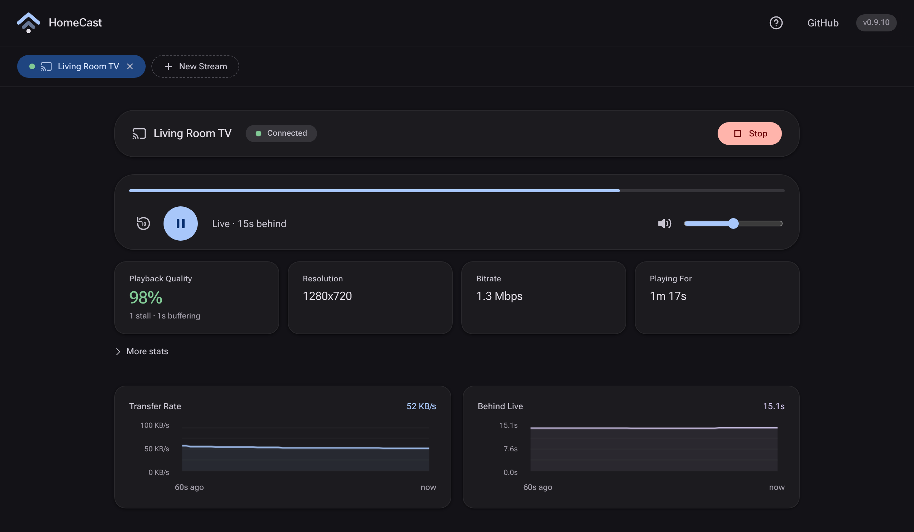
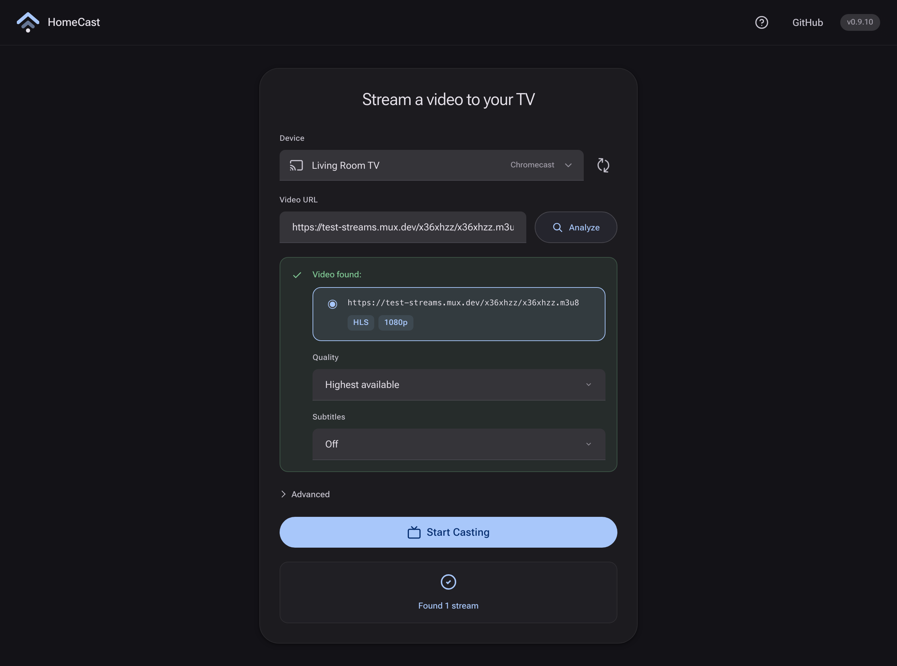

<p align="center">
  <picture>
    <source media="(prefers-color-scheme: dark)" srcset="docs/images/logo-dark.svg">
    
  </picture>
</p>

<p align="center">
  Self-hosted casting from web pages to Chromecast, Apple TV and LG TVs.
</p>

<p align="center">
  <a href="https://github.com/simno/homecast/actions/workflows/test.yml"></a>
  <a href="https://github.com/simno/homecast/pkgs/container/homecast"></a>
  <a href="LICENSE"></a>
</p>

---

HomeCast runs on a machine on your home network. You give it the URL of a web page. It finds the video on that page
and sends it to a TV, proxying and fixing up the stream where the TV couldn't play it directly. Casting doesn't depend
on your laptop or phone: once the video has started, you can close the tab.



<details>
<summary>Casting a stream</summary>



</details>

## Features

- **Stream detection.** Finds the stream behind a page: player markup, embedded JSON, iframes, player scripts, and as
  a last resort a headless browser that watches the page's network requests.
- **HLS, DASH, MP4 and WebM**, live and on demand, with a quality picker and subtitles (from the page, from the stream,
  or from a WebVTT/SRT URL).
- **Three kinds of receiver**, discovered automatically over mDNS and SSDP: Chromecast and Cast TVs, Apple TV (AirPlay,
  including PIN pairing) and LG webOS TVs.
- **Live streams** start near the live edge. You can go back along the timeline and jump to live again.
- **Up next.** Queue videos behind the one playing. The queue is kept on the server and moves on by itself when a
  video ends, with no browser open.
- **Remote control and health.** Pause, seek and change the volume from the dashboard. The dashboard shows transfer
  rate, buffering and latency, and restarts streams that stall.
- **4K on Chromecast.** 4K H.264 streams are converted to HEVC on the fly with an Intel, AMD or NVIDIA GPU.
- **Wake-on-LAN** for devices that are asleep.
- **Send pages from any tab** with a bookmarklet, a `/?url=` link (for phone shortcuts), or the share menu when
  HomeCast is installed as an app over HTTPS.

## Quick start

HomeCast needs to be on the same network as your TVs, and in Docker it needs host networking for device discovery.

```yaml
# docker-compose.yml
services:
  homecast:
    image: ghcr.io/simno/homecast:latest
    container_name: homecast
    network_mode: host
    restart: unless-stopped
    volumes:
      - homecast-data:/app/data   # AirPlay pairings and LG TV keys

volumes:
  homecast-data:
```

```bash
docker compose up -d
```

Open `http://<host>:3000`, pick a device, paste a URL, press **Analyze**, then **Start Casting**.

<details>
<summary>Other ways to run it</summary>

**docker run**

```bash
docker run -d --name homecast --network host --restart unless-stopped \
  -v homecast-data:/app/data ghcr.io/simno/homecast:latest
```

**From source** (Node.js 26 or newer)

```bash
git clone https://github.com/simno/homecast.git
cd homecast
npm install
npm start
```

**Build the image yourself**

```bash
docker build -t homecast .                              # full
docker build --build-arg VARIANT=lite -t homecast .     # without the headless browser
docker build --build-arg TRANSCODE=none -t homecast .   # without FFmpeg
```

</details>

### Images

| Tag                        | Size (amd64 / arm64) | Contents                                               |
|----------------------------|----------------------|--------------------------------------------------------|
| `latest`, `1.2.3`, `1.2`   | ~420 MB / ~330 MB    | Everything                                             |
| `lite`, `1.2.3-lite`       | ~180 MB / ~90 MB     | No headless browser                                    |

The two images handle direct links, HLS/DASH, Twitch and ordinary embedded players the same way. `lite` can't find
streams on pages that only reveal them after running JavaScript. When that may be the reason nothing was found,
Analyze says so. amd64 images include FFmpeg for [4K conversion](docs/4k-conversion.md). arm64 images don't.

## Devices

| Receiver              | Plays                     | Notes                                                                         |
|-----------------------|---------------------------|-------------------------------------------------------------------------------|
| Chromecast / Cast TVs | HLS, DASH, MP4, WebM      | Subtitles can be switched during playback. 4K H.264 needs [a GPU to convert it](docs/4k-conversion.md) |
| Apple TV (AirPlay)    | HLS, MP4                  | PIN pairing supported. TVs with only AirPlay 2 built in aren't supported      |
| LG webOS TVs          | HLS, DASH, MP4            | Plays in the TV's browser, 4K H.264 included, without conversion              |

For pairing, the LG permission prompt and per-device limits, see [docs/devices.md](docs/devices.md).

## Supported sources

- Direct video files (MP4, WebM) and HLS or DASH streams
- Web pages whose player uses one of those, including players in iframes and players that only load in a browser
- Sites with their own handling in the code: **Twitch** (live and VODs), **X / Periscope** broadcasts and
  **SpaceX** launch pages

HomeCast can't play DRM-protected content (Netflix, Disney+ and other subscription services, or DASH with
`ContentProtection`). It also can't play YouTube or MJPEG webcam streams. These were tested on a limited number of
sites, so other sites may well not work. Issues saying which sites work or don't are welcome. For how streams are
found, see [docs/how-it-works.md](docs/how-it-works.md).

## Configuration

Most setups need no configuration. The settings you're most likely to change:

| Variable                  | Default     | Description                                                  |
|---------------------------|-------------|--------------------------------------------------------------|
| `PORT`                    | `3000`      | Web interface port                                           |
| `HOST_IP`                 | auto-detect | LAN address the receivers fetch streams from                 |
| `CSRF_SECRET`             | random      | Set it to keep browser sessions valid across restarts        |
| `TRANSCODE_DEVICE`        | auto        | GPU for 4K conversion, e.g. `renderD129`                     |

For every variable, the ports to open in a firewall, and GPU passthrough, see
[docs/configuration.md](docs/configuration.md).

## Security

HomeCast is meant for a **trusted private network**. Don't expose it to the internet. It fetches URLs on request, so
it has protection against server-side request forgery (SSRF), enabled by default: requests to private and loopback
addresses and to cloud metadata endpoints are blocked. It also has per-IP rate limits and CSRF protection.

## Documentation

- [Devices](docs/devices.md): Apple TV pairing, LG webOS, and subtitles on each device
- [4K on Chromecast](docs/4k-conversion.md): GPU requirements, setup and quality
- [Configuration](docs/configuration.md): environment variables and firewall ports
- [How it works](docs/how-it-works.md): stream detection and architecture
- [Troubleshooting](docs/troubleshooting.md)

## Contributing

Bug reports and pull requests are welcome. [CONTRIBUTING.md](CONTRIBUTING.md) covers the development setup, tests and
releases.

## License

[MIT](LICENSE)

HomeCast builds on [castv2-client](https://github.com/thibauts/node-castv2-client),
[multicast-dns](https://github.com/mafintosh/multicast-dns), [dash.js](https://github.com/Dash-Industry-Forum/dash.js),
[Playwright](https://playwright.dev) and [FFmpeg](https://ffmpeg.org) (in
[Jellyfin's build](https://github.com/jellyfin/jellyfin-ffmpeg)).
